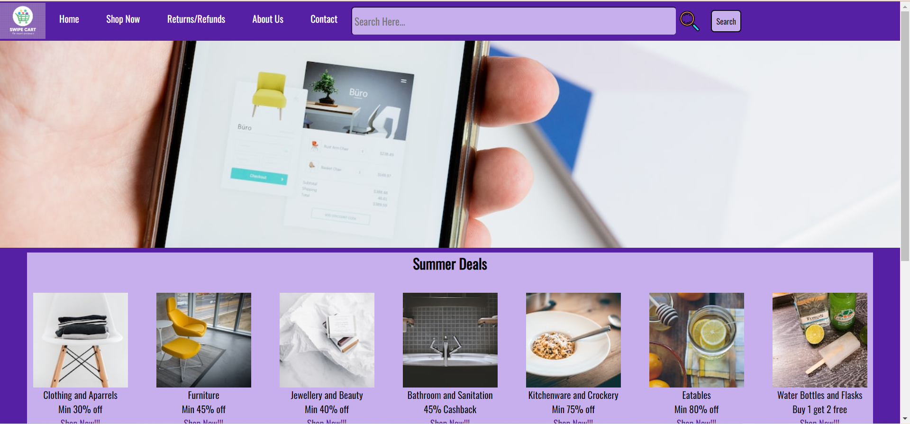
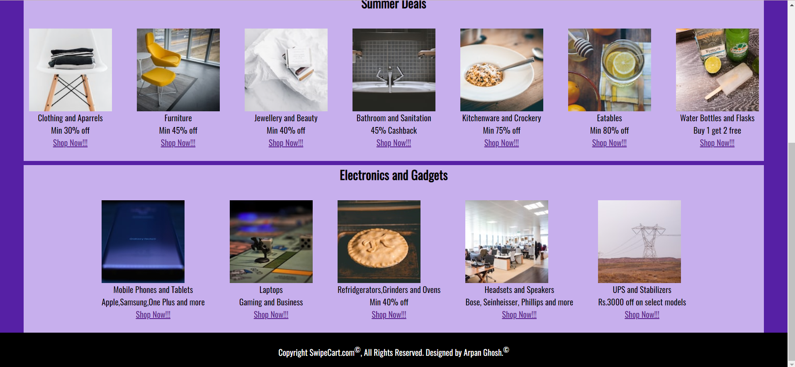

<h1><ins>HomePage design of a simple E-commerce Website "SwipeCart"</ins></h1>
<b>This is what my webpage looks like:-</b>  
 

Hello!!!In this project, I have designed the home page of an imaginary E-commerce website which I have named as <b>"SwipeCart"</b> using just HTML and CSS. One thing to be noted here is that, in this project I have <b>focussed on the designing aspect</b> of the website only and it's 'look and feel' and <b>not the the actual functioning</b>. Another thing to be noted is that I have added <b>dynamic images</b> that dynamically keep changing every time the webpage is refreshed. I have added these images from https://unsplash.com/. Also another thing to be noted here is that even though I have tried to add a bit of responsiveness to my website, it is still <b>recommended that it is opened and viewed on a P.C</b> itself for a highly responsive experience.
 
I really hope that you like this mini-project!!!
